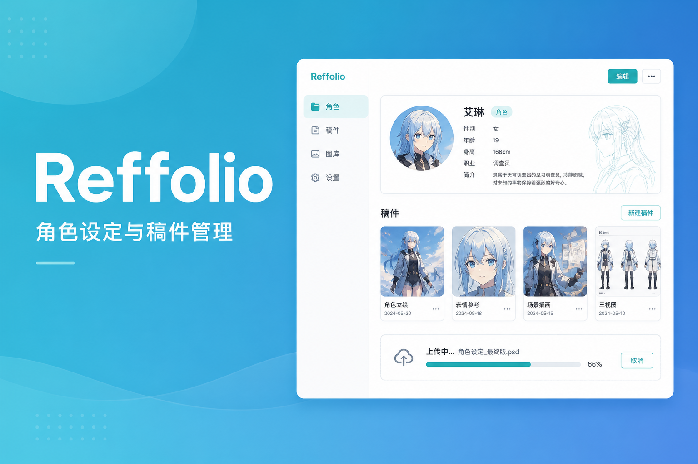

# Reffolio

<p align="center">
  
</p>

<p align="center">
  <strong>角色设定与稿件管理系统</strong><br>
  一个角色 · 多张主设 · 多件稿件 · 画师外链上传 · 本地 / 腾讯云 COS
</p>

<p align="center">
  <a href="#快速开始"></a>
  <a href="#快速开始"></a>
  <a href="../LICENSE"></a>
  <a href="#功能一览"></a>
</p>

---

轻量、无 Composer 依赖的 PHP 应用，适合个人站长 / 约稿方管理角色设定与委托稿件。开箱可用本地上传，也可一键切换到腾讯云 COS 直传。

## 功能一览

| 模块 | 能力 |
|------|------|
| 角色档案 | 多张主设图、标签、简介；封面与头像可分开设置 |
| 稿件管理 | 多图上传、分类筛选、备注、ZIP 原图打包下载 |
| 画师链接 | 生成上传邀请：1/3/5/永久次数与有效期，可开关管理 |
| 公开分享 | 角色页 / 稿件页公开访问，无需登录 |
| 站点配置 | Logo、站点名、导航与首页文案可后台修改 |
| 主题 | 白天 / 黑夜模式 |
| 存储 | 本地 `uploads/` 或腾讯云 COS（浏览器直传，不经 PHP） |
| 权限 | 管理员徽章；存储 / 站点设置仅管理员可改 |

## 数据模型

```
users 1 ──< N characters 1 ──< N character_images
                     │
                     └──< N works 1 ──< N work_images
```

另含：`upload_invites`（画师链接）、`work_categories`、`app_settings`。

## 环境要求

- PHP 8.0+（扩展：`pdo_mysql`、`fileinfo`、`gd` 或可用的图片识别、`zip`）
- MySQL 8+ / MariaDB 兼容
- Web 服务器（Nginx / Apache）或 `php -S` 本地调试
- （可选）腾讯云 COS 存储桶 + CORS

## 快速开始

### 1. 克隆仓库

```bash
git clone https://github.com/guanyisheng/reffolio.git
cd reffolio/reffolio
```

### 2. 配置数据库

```bash
cp config/database.example.php config/database.php
# 编辑 config/database.php，填写 host / dbname / user / pass
```

导入结构（推荐先建空库）：

```bash
mysql -u root -p -e "CREATE DATABASE reffolio DEFAULT CHARACTER SET utf8mb4 COLLATE utf8mb4_unicode_ci;"
mysql -u root -p reffolio < sql/database.sql
```

若你是从旧库升级，按需执行 `sql/migration_*.sql`。

### 3. 目录权限

保证 Web 用户可写：

```bash
chmod -R 775 uploads
```

### 4. 启动

```bash
php -S localhost:8080
```

浏览器打开 `http://localhost:8080`，注册账号后即可使用。  
第一个需要改存储 / 站点文案的用户，请在数据库把 `users.is_admin` 设为 `1`，或执行管理员相关迁移后在「用户管理」中授权。

### 5. （可选）存储与站点

登录管理员后：

- **存储设置** `/settings.php` — 本地或 COS
- **站点设置** `/site_settings.php` — Logo、文案、导航

COS 真实密钥保存在数据库 `app_settings`，不会写进仓库里的 `config/storage.php`。

## 腾讯云 COS 直传

启用 COS 后，图片由浏览器直接 `PUT` 到存储桶。请在桶的 **跨域 CORS** 中至少允许：

| 项 | 建议值 |
|----|--------|
| Origin | 你的站点域名 |
| Methods | `PUT`, `GET`, `HEAD` |
| Allow-Headers | `*` 或含 `content-type` |
| Expose-Headers | `ETag`, `Content-Length` |

私有桶展示时会自动签发临时 URL；批量下载 ZIP 同样支持从 COS 拉原图。

## 主要页面

| 路径 | 说明 |
|------|------|
| `/characters.php` | 我的角色 |
| `/create_character.php` | 新建角色 |
| `/character.php?id=` | 角色主页 |
| `/upload_work.php` | 四步上传稿件 |
| `/work.php?id=` | 稿件详情 + ZIP |
| `/invites.php` | 画师上传链接管理 |
| `/artist_upload.php?token=` | 画师免登录上传 |
| `/share_character.php` / `/share_work.php` | 公开分享 |
| `/categories.php` | 稿件分类 |
| `/settings.php` / `/site_settings.php` | 管理员设置 |

## 安全说明（开源部署必读）

- **不要**把 `config/database.php` 提交到公开仓库（已在 `.gitignore`）
- 生产环境请使用强密码，并限制数据库仅本机或内网访问
- `uploads/` 已带 `.htaccess` 示例，建议 Nginx 同样禁止执行脚本
- COS SecretKey 只通过后台保存，勿写入代码仓库

## 技术栈

- 后端：原生 PHP 8（无框架、无 Composer）
- 前端：原生 JS + CSS（主题切换、上传进度、COS 直传）
- 数据库：MySQL 8

## 贡献

欢迎 Issue / PR：修 bug、补文档、改进移动端体验、增加存储驱动都可以。  
提交前请确认不含真实密钥与用户上传文件。

## License

[MIT](../LICENSE) © Reffolio contributors
